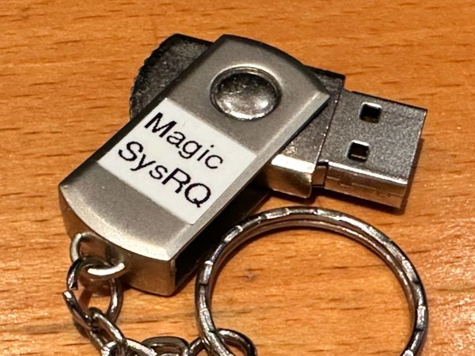

# Magic SysRQ+REISUB appliances

Virtual keyboards that enter [Magic SysRQ and the REISUB sequence](https://www.kernel.org/doc/html/latest/admin-guide/sysrq.html). Do note however, that the REI part seems to be disabled on many systems nowadays and is implemented for nostalgic reasons only.

- **ArduinoReisub** is for "ATmega32U4 BadUSB Beetles" as found on Ebay. Compile for "Arduino Leonardo".
- **DigisparkReisub** is for clones of the [ATtiny85 Digispark Board](http://digistump.com/products/1). Compile for "Digispark Default 16.5 MHz".
  - [Instructions for setting up the Arduino IDE for Digispark](http://digistump.com/wiki/digispark/tutorials/connecting)
  - The Digispark sketch outputs a diagnostic-ish blink pattern; see the sketch about that.
- **TL;DR:** The Digispark has been found to be unreliable on some USB hubs and hosts, due to its lack of native USB Keyboard support. Use an ATmega 32U4 BadUSB Beetle for predictable results.

